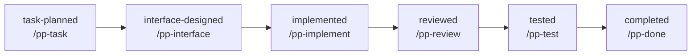

# PP: Project Planning & Implementing

PP is a workflow system for planning and executing projects incrementally with a project-specific pipeline.

**NOTE**: the prefix for skills is written as `/pp-help` are compatible with *cursor* and *claude-code*. use `$pp-help` in *codex*.

## Core Workflow

Most projects should use only these commands:

1. `/pp-help`  
   Show workflow guidance.
2. `/pp-init <language>`  
   Initialize or migrate PP files in `plan/`.
3. `/pp-plan`  
   Create or revise the task plan.
4. `/pp-next`  
   Run the next stage from the active pipeline.

Use `/pp-next auto` to auto-advance and pause only at approval gates.

## Default Pipeline Diagram

The default pipeline moves left-to-right through the stages below. In step mode, each stage is proposed one at a time; in auto mode, behavior is controlled by `approval_gate` and `auto_behavior`.

Stage explanations:
- `task-planned` (`pp-task`): Selects the next task from `plan/plan.md` and creates a task file with pipeline-linked progress entries.
- `interface-designed` (`pp-interface`): Defines/locks the public interface and acceptance criteria before implementation.
- `implemented` (`pp-implement`): Implements the task according to the approved interface and updates progress.
- `reviewed` (`pp-review`): Reviews implementation quality and requirement fit; default pipeline marks this stage as `auto: skip`.
- `tested` (`pp-test`): Adds/runs minimal tests aligned with acceptance criteria.
- `completed` (`pp-done`): Finalizes task state and updates plan artifacts to mark completion.



This diagram reflects the default initialization template; `plan/PIPELINE.md` remains the runtime source of truth.

**NOTE**: it is possible to customize the pipeline to your project's workflow.

## Core Configuration

The most important project files are:

- `plan/AGENTS.md`  
  Coding and testing standards for this project.
- `plan/PIPELINE.md`  
  Stage order and orchestration policy for `/pp-next`:
  - stage sequence
  - stage actions
  - approval gates
  - auto-skip behavior

## Quick Start

```text
/pp-init python
/pp-plan
/pp-next
```

## Pipeline Commands Reference

These are user-facing runtime commands for pipeline control and visibility:

- `/pp-next`  
  Execute the next stage in step mode (`yes`, `skip`, `replan`, `auto`, `stop`).
- `/pp-next auto`  
  Execute automatically based on per-stage gate and auto behavior rules.
- `/pp-status`  
  Show current task/stage state and next action.
- `/pp-pipeline`  
  Validate and summarize `plan/PIPELINE.md`.
- `/pp-pipeline-edit`  
  Edit `plan/PIPELINE.md` (wizard), or use `summary` / `print`.

`/pp-pipeline-edit` notes:
- `summary` prints ordered stages with gates/auto/actions
- `print` outputs the full raw pipeline file
- structural edits migrate only the active task if one exists

## Utility Commands

These commands are intentionally independent from task planning and pipeline stages:

- `/pp-todo`  
  List future-reference TODO items from `plan/todo.md`.
- `/pp-todo "text"`  
  Add a new TODO item to `plan/todo.md`.
- `/pp-gen-reference`  
  Generate or refresh `plan/reference.md` by scanning the repo.

## Internal Actions (Not Primary User Commands)

These skills are orchestration internals and are usually invoked through `/pp-next`:

- `/pp-task`
- `/pp-interface`
- `/pp-implement`
- `/pp-review`
- `/pp-test`
- `/pp-commit`
- `/pp-done`
- `/pp-stage-runner`

They remain available, but normal usage should stay on the core workflow and pipeline commands.

## Install

```bash
./install.sh <platform>
```

Platforms: `cursor`, `claude`, `codex`, `all`.

To remove:

```bash
./install.sh <platform> --remove
```

## Repository Layout

- `skills/` - PP skills
- `rules/` - optional Cursor rule
- `agents/` - helper subagent definitions
- `install.sh` - installer/uninstaller
