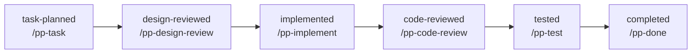

# PP: Project Planning & Implementing

PP is a workflow system for planning and executing projects incrementally with a project-specific pipeline.

**NOTE**: Use `/pp-help` in *cursor* and *claude-code*; use `$pp-help` in *codex*.

## Quickstart

### Setup

```text
/pp-init <language>
```

`/pp-init` scaffolds:
- `plan/*` planning files
- `docs/architecture/README.md`
- `docs/architecture/system-map.yaml`
- `docs/architecture/c4-context.md`
- `docs/architecture/c4-container.md`
- `docs/architecture/c4-components.md`
- `docs/architecture/sequences/`
- `docs/architecture/adrs/`
- `docs/catalog/architecture-code-catalog.md`

**Legacy only**: Bootstrap architecture docs for an existing project
```text
/pp-arch-catalog
```

### Core Workflow

Most projects should use only these commands:

1. `/pp-plan` -- create or revise the project task list.
2. `/pp-next` -- run the next stage from the active pipeline.

Use `/pp-next auto` to auto-advance and pause only at approval gates.
Use `/pp-next continue-task` to finish one task while bypassing approval gates.
Use `/pp-next continue-all` to finish all remaining tasks while bypassing approval gates.
Continue modes require a git commit at the end of each task, owned by `pp-done`.
Internally, `/pp-next` passes normalized orchestration policy downstream instead of making leaf skills infer behavior from command names.

Project state is tracked in `plan/plan.md`, with stage policy in `plan/PIPELINE.md`.
Architecture artifacts live under `docs/architecture/`.

## Default Pipeline

The default pipeline moves left-to-right through the stages below. In step mode, each stage is proposed one at a time; in auto mode, behavior is controlled by `approval_gate` and `auto_behavior`. The continue modes honor `auto_behavior` but bypass `approval_gate`.

- `task-planned` (`pp-task`): Creates complete `task-{id}.md` specs, including explicit ADR and sequence-diagram subtasks when architecture-impacting work requires them.
- `design-reviewed` (`pp-design-review`): Hard gate to review and iterate task design before implementation.
- `implemented` (`pp-implement`): Executes approved subtasks and creates/updates planned ADR, sequence, C4, and system-map artifacts.
- `code-reviewed` (`pp-code-review`): Reviews implementation quality, requirement fit, and whether planned architecture artifacts are compatible and up to date.
- `tested` (`pp-test`): Adds/runs minimal tests aligned with acceptance criteria.
- `completed` (`pp-done`): Finalizes task state and applies incremental catalog deltas (no full catalog recompute).


```mermaid
flowchart LR
    A["task-planned<br/>/pp-task"] --> B["design-reviewed<br/>/pp-design-review"]
    B --> C["implemented<br/>/pp-implement"]
    C --> D["code-reviewed<br/>/pp-code-review"]
    D --> E["tested<br/>/pp-test"]
    E --> F["completed<br/>/pp-done"]
```

`plan/PIPELINE.md` is the runtime source of truth and can be customized.

## Core Configuration

The most important project files are:

- `plan/AGENTS.md`
  Coding and testing standards for this project.
- `plan/PIPELINE.md`
  Stage order and orchestration policy for `/pp-next`:
  - stage sequence
  - stage actions
  - approval gates
  - auto-skip behavior

## Pipeline Commands Reference

These are user-facing runtime commands for pipeline control and visibility:

- `/pp-next`
  Execute the next stage in step mode (`yes`, `skip`, `replan`, `auto`, `continue-task`, `continue-all`, `stop`).
- `/pp-next auto`
  Execute automatically based on per-stage gate and auto behavior rules.
- `/pp-next continue-task`
  Execute automatically until the current task is completed, bypassing approval gates.
- `/pp-next continue-all`
  Execute automatically until all remaining tasks are completed, bypassing approval gates.
- `/pp-status`
  Show current task/stage state and next action.
- `/pp-pipeline`
  Validate and summarize `plan/PIPELINE.md`.
- `/pp-pipeline-edit`
  Edit `plan/PIPELINE.md` (wizard), or use `summary` / `print`.

`/pp-pipeline-edit` notes:
- `summary` prints ordered stages with gates/auto/actions
- `print` outputs the full raw pipeline file
- structural edits migrate only the active task if one exists

## Utility Commands

These commands are intentionally independent from task planning and pipeline stages:

- `/pp-todo`
  List future-reference TODO items from `plan/todo.md`.
- `/pp-todo "text"`
  Add a new TODO item to `plan/todo.md`.
- `/pp-arch-catalog`
  Bootstrap the Architecture/Code Catalog and architecture baseline once for a legacy repo.

## Internal Actions (Not Primary User Commands)

These skills are orchestration internals and are usually invoked through `/pp-next`:

- `/pp-task`
- `/pp-design-review`
- `/pp-implement`
- `/pp-code-review`
- `/pp-test`
- `/pp-commit`
- `/pp-done`
- `/pp-stage-runner`

They remain available, but normal usage should stay on the core workflow and pipeline commands.

## Install

```bash
./install.sh <platform>
```

Platforms: `cursor`, `claude`, `codex`, `all`.

To remove:

```bash
./install.sh <platform> --remove
```

## Repository Layout

- `skills/` - PP skills
- `rules/` - optional Cursor rule
- `agents/` - helper subagent definitions
- `install.sh` - installer/uninstaller

## Helpful tools
- `docsify` to view the plans
- `meld` to view diffs

# Notes
* My experience is that this pipeline works well with *codex*, it did not work for me with *cursor*.

# Future enhancements
* Simplified documentation requirements
* Simple support for manual code updates
